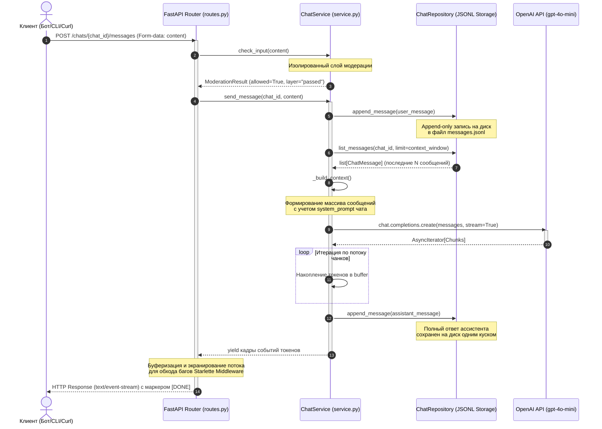

# Документация модуля управления контекстом и историей чатов (app/chat)

## 1. Архитектурная диаграмма последовательности (Mermaid)

Ниже представлена схема обработки входящего сообщения пользователя, сборки контекста методом Скользящего окна (Sliding Window) и генерации ответа через OpenAI API.



## 2. Обоснование выбранной стратегии контекста

В рамках подзадачи №5 была выбрана и реализована стратегия **Sliding Window (Скользящее окно)** со значением лимита по умолчанию `chat_context_window = 10` сообщений.

### Инженерное обоснование:
1. **Специфика проекта поддержки (`bag_assistant`)**: Инструмент автоматического разбора багов и помощи в IT-онбординге оперирует короткими диалоговыми сессиями. Пользователь описывает конкретную техническую ошибку, ассистент задает 2-3 уточняющих вопроса и выдает инструкцию. История глубже 10 шагов теряет актуальность.
2. **MLOps Cost Control (Контроль затрат)**: Скользящее окно жестко фиксирует максимальное количество токенов, отправляемых в LLM. Это защищает проект от экспоненциального роста стоимости API-запросов на длинных «зацикленных» диалогах.
3. **Оптимизация Time-to-First-Token (TTFT)**: Чтение ограниченного количества строк из append-only хранилища `messages.jsonl` без полного разбора всего файла (цикла parse-rewrite-write) выполняется за константное время \(O(1)\), что минимизирует задержку генерации ответа.

## 3. Практические примеры Curl-запросов для проверки эндпоинтов

### 1. Создание нового чата (Идемпотентно)
```bash
curl -X POST http://127.0.0 \
  -H "Content-Type: application/json" \
  -d "{\"owner_external_id\":\"test-1\",\"interface\":\"cli\"}"
```
*Ожидаемый ответ:* `{"chat_id": "8f7a5406-bb79-45e7-88eb-06bd77130afe"}`

### 2. Отправка сообщения (SSE Streaming)
Передача контента реализована через безопасный `multipart/form-data` формат для предотвращения конфликтов с асинхронными middleware Starlette фреймворка.
```bash
curl -N -X POST http://localhost:8000/chats/ВСТАВЬ_СЮДА_CHAT_ID/messages \
  -F "content=Привет, меня зовут Аня"
```
*Ожидаемый потоковый ответ:*
```text
data: {"type": "token", "delta": "Привет"}
data: {"type": "token", "delta": "!"}
data: {"type": "message_saved", "message_id": "1f3843c3-..."}
data: [DONE]
```

### 3. Получение хронологической истории сообщений чата
```bash
curl -X GET "http://localhost:8000/chats/ВСТАВЬ_СЮДА_CHAT_ID/messages?limit=50"
```
*Ожидаемый ответ:* Хронологический массив объектов `[user, assistant, user, assistant, ...]`

### 4. Мягкая очистка истории диалога (Soft Delete)
```bash
curl -X DELETE http://localhost:8000/chats/ВСТАВЬ_СЮДА_CHAT_ID/messages
```
*Ожидаемый ответ:* `{"status":"ok"}`. При последующем вызове `GET /messages` вернется пустой список `[]`.
